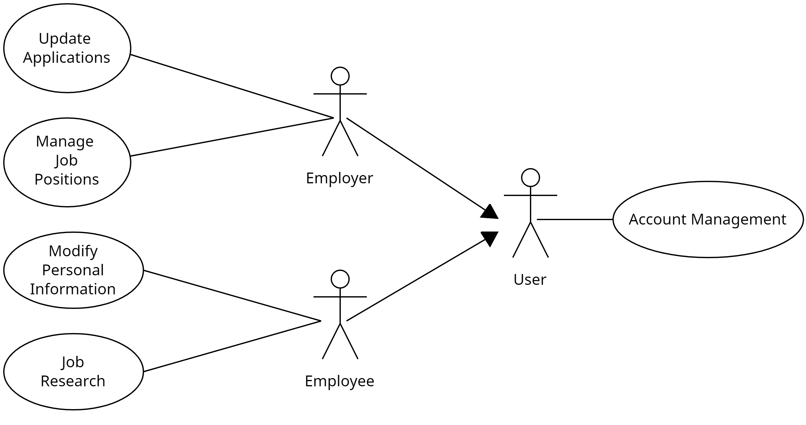

# NetworkMeUp - Εφαρμογή εύρεσης εργασίας

Η εφαρμογή στοχεύει στη διευκόλυνση της διαδικασίας εύρεσης εργασίας και τη δημιουργία ενός διαύλου επικοινωνίας μεταξύ των εργοδοτών και των ενδιαφερόμενων εργαζομένων. Οι χρήστες της παραπάνω εφαρμογής χωρίζονται σε δύο κατηγορίες, τους εργοδότες και τους εργαζομένους, για τους οποίους απαιτείται η εγγραφή στο σύστημα.

Μέσα από την εφαρμογή αυτή οι εργαζόμενοι θα είναι σε θέση να ανεβάσουν το βιογραφικό τους στο σύστημα, να αναζητήσουν θέσεις εργασίας και να εκδηλώσουν το ενδιαφέρον τους. Κάθε εργαζόμενος θα έχει τη δυνατότητα να μεταβάλλει τις πληροφορίες του βιογραφικού του ανά πάσα στιγμή. Το σύστημα, από την πλευρά του, θα εμφανίζει στον ενδιαφερόμενο πληροφορίες σχετικά με το βαθμό ταιριάσματος του βιογραφικού του με τη θέση εργασίας, έτσι ώστε να αποφύγει άσκοπες υποβολές αιτημάτων.

Από την άλλη πλευρά, οι εργοδότες θα μπορούν να ανεβάζουν θέσεις εργασίας, οι οποίες θα περιλαμβάνουν κατάλληλα δεδομένα, έτσι ώστε να διευκολύνεται η αυτοματοποιημένη αντιστοίχισή τους με βιογραφικά εργαζομένων (πχ. απαιτούμενο πτυχίο/πτυχία, ξένες γλώσσες, απαιτούμενες δεξιότητες, ελάχιστα χρόνια προϋπηρεσίας σε συγκεκριμένο τομέα, κτλ.). Θα είναι σε θέση, επίσης, να προβάλλουν τα βιογραφικά που έχουν υποβληθεί για κάθε θέση εργασίας και να τα απορρίπτουν ή να καλούν τους εργαζομένους για συνέντευξη. Το σύστημα, από την πλευρά του, θα εμφανίζει στατιστικά στοιχεία προς τους εργοδότες όπως πλήθος αιτημάτων ανά θέση εργασίας, πλήθος αιτημάτων ανά τομέα που ανήκει η κάθε θέση εργασίας κτλ..

Έτσι, λοιπόν, οι εργαζόμενοι θα έχουν τη δυνατότητα να έχουν πρόσβαση σε μια μεγάλη γκάμα θέσεων εργασίας και να υποβάλλουν αίτηση σε εκείνες τις αρέσκειάς τους, ενώ οι εργοδότες θα μπορούν να καλύπτουν τις διαθέσιμες ειδικότητες με τους καταλληλότερους υποψηφίους. 

## Use-Case UML διάγραμμα

