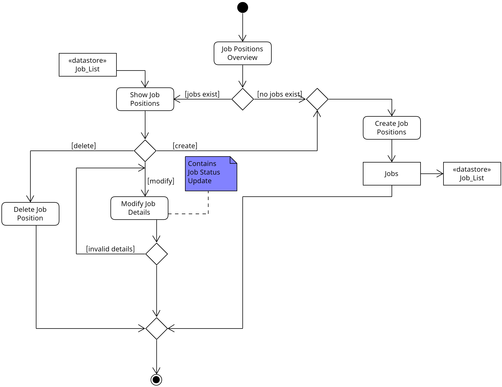

# ΠΧ4 Διαχείριση Θέσεων Εργασίας

**Πρωτεύων Actor**: Εργοδότης

<u>**Ενδιαφερόμενοι**</u>

**Εργοδότης:** Θέλει να δημιουργήσει νέες θέσεις εργασίας, να διαγράψει αυτές που έχουν καλυφθεί και να τροποποιήσει τις ήδη υπάρχουσες στο σύστημα.

**Ανώτερο Στέλεχος Εταιρίας:** Θέλει να συνεργαστεί με άτομα τα οποία πληρούν όσο το δυνατόν καλύτερα τις απαιτήσεις των θέσεων εργασίας και τις απαιτήσεις της εταιρίας.

<u>**Προϋπόθεση</u>:** Ο εργοδότης έχει συνδεθεί επιτυχώς στο σύστημα.

## <u>Βασική Ροή</u>

### Α) Δημιουργία Θέσης Εργασίας

1. Ο εργοδότης επιλέγει την "Επισκόπηση Θέσεων Εργασίας".
2. Το σύστημα εμφανίζει τις θέσεις εργασίας που υπάρχουν για την εταιρία του.
3. Ο εργοδότης επιλέγει την "Δημιουργία Θέσης Εργασίας".
4. Το σύστημα ζητάει από τον εργοδότη να συμπληρώσει μια περιγραφή της θέσης, λέξεις κλειδιά (keywords) που σχετίζονται με τον βασικό τομέα της θέσης, απαιτούμενες ικανότητες (skills) στην μορφή keywords, τον σχετικό μισθό και προαιρετικά οτιδήποτε τυχών έξτρα προνόμιο (bonuses) παρέχεται από την εταιρία.
5. Ο εργοδότης δίνει τις πληροφορίες αυτές και επιλέγει "Εκτέλεση Δημιουργίας".
6. Το σύστημα καταγράφει την νέα θέση εργασίας και την προσθέτει στις διαθέσιμες θέσεις εργασίας. 

**Εναλλακτικές Ροές**

*5α. Δεν συμπληρώθηκε κάποιο από τα υποχρεωτικά πεδία* 

    1. Το σύστημα εμφανίζει σχετικό μήνυμα και αποτρέπει την εκτέλεση δημιουργίας της θέσης.
    2. Επιστρέφει στο βήμα 5.

### Β) Τροποποίηση Θέσης Εργασίας

1. Ο εργοδότης επιλέγει την "Επισκόπηση Θέσεων Εργασίας".
2. Το σύστημα εμφανίζει τις θέσεις εργασίας που υπάρχουν για την εταιρία του.
3. Ο εργοδότης επιλέγει μια θέση εργασίας.
4. Το σύστημα εμφανίζει ένα μενού επιλογών σχετικά με την εργασία.
5. Ο εργοδότης επιλέγει την "Τροποποίηση Θέσης Εργασίας".
6. Το σύστημα εμφανίζει τις λεπτομέρειες της θέσεως εργασίας μαζί με την επιλογή να αλλάξει οποιδήποτε από τα πεδία.
7. Ο εργοδότης αλλάζει κάποια πληροφορία σχετικά με τη θέση αυτή και επιλέγει "Αποθήκευση Αλλαγών".
8. Το σύστημα αποθηκεύει τις αλλαγές και ενημερώνει όλους τους αιτώντες πως έγινε αλλαγή στη θέση αυτή.

**Εναλλακτικές Ροές**

*2α. Δεν υπάρχουν θέσεις εργασίας* 

    1. Το σύστημα εμφανίζει σχετικό μήνυμα
    2. Η περίπτωση χρήσης τερματίζει.  

*7α. Κενή πληροφορία κάποιου υποχρεωτικού πεδίου* 
    1. Το σύστημα εμφανίζει σχετικό μήνυμα και αποτρέπει την εκτέλεση της τροποποίησης.
    2. Επιστρέφει στο βήμα 7.

### Γ) Αλλαγή Κατάστασης Θέσης Εργασίας

1. Ο εργοδότης επιλέγει την "Επισκόπηση Θέσεων Εργασίας".
2. Το σύστημα εμφανίζει τις θέσεις εργασίας που υπάρχουν για την εταιρία του.
3. Ο εργοδότης επιλέγει μια θέση εργασίας.
4. Το σύστημα εμφανίζει ένα μενού επιλογών σχετικά με την εργασία.
5. Ο εργοδότης επιλέγει την "Διαμόρφωση Κατάστασης"
6. Το σύστημα εμφανίζει τις επιλογές αλλαγής κατάστασης(διαθέσιμη, προσωρινά μη διαθέσιμη, κλειστή), καθώς και την τρέχουσα κατάσταση για την θέση εργασίας.
7. Ο εργοδότης αλλάζει την τρέχουσα κατάσταση της θέσης εργασίας.
8. Το σύστημα αποθηκεύει την αλλαγή και ειδοποιεί όλους τους αιτώντες για την αλλαγή αυτή με σχετικό μήνυμα.

### Δ) Διαγραφή Θέσης Εργασίας

1. Ο εργοδότης επιλέγει την "Επισκόπηση Θέσεων Εργασίας".
2. Το σύστημα εμφανίζει τις θέσεις εργασίας που υπάρχουν για την εταιρία του.
3. Ο εργοδότης επιλέγει μια θέση εργασίας.
4. Το σύστημα εμφανίζει ένα μενού επιλογών σχετικά με την εργασία.
5. Ο εργοδότης επιλέγει την "Διαγραφή Θέσης Εργασίας".
6. Το σύστημα ζητάει για επιβεβαίωση της ενέργειας.
7. Ο εργοδότης επιβεβαιώνει την θέλησή του.
8. Το σύστημα ενημερώνει όλους τους αιτώντες για το σχετικό γεγονός.
9. Η θέση εργασίας διαγράφεται από το σύστημα μαζί με τις σχετικές πληροφορίες της.

**Εναλλακτικές Ροές**

*2α. Δεν υπάρχουν θέσεις εργασίας* 

    1. Το σύστημα εμφανίζει σχετικό μήνυμα
    2. Η περίπτωση χρήσης τερματίζει.  

*7α. Ο εργοδότης δεν επιβεβαίωσε την διαγραφή* 

    1. Η περίπτωση χρήσης τερματίζει.  

## 